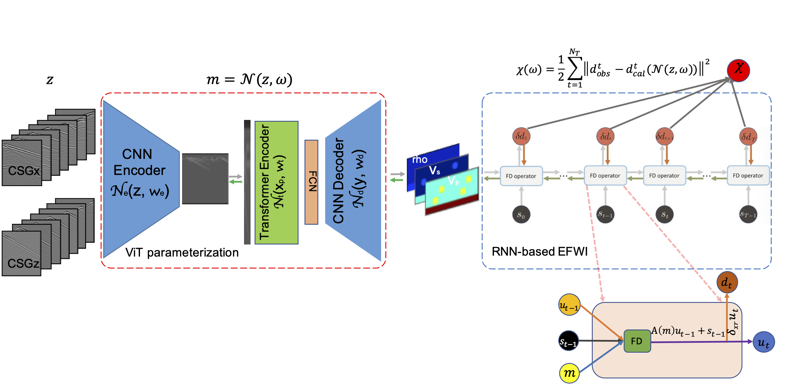
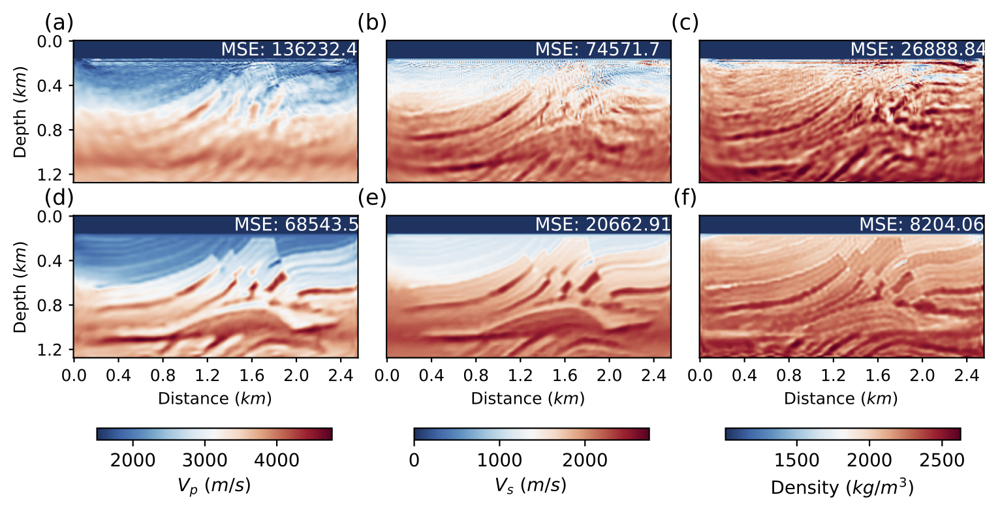

# vit-efwi
This repository contains both the dataset and the codebase for ViT-EFWI, a project aimed at replicating the findings detailed in our submitted manuscript titled "Improved elastic full-waveform inversion with Vision Transformer reparameterization and Recurrent Neural Network reformulation".




## Folder structure
The list of files: 
```bash
.
├── README.md
├── data
│   ├── generate_model_polt.ipynb
│   ├── model
│   ├── observed
│   └── raw_model
├── fig
│   ├── marmousi2_vit_deepwave.png
│   └── vitefwi_flow.png
├── paper_result
│   ├── bp
│   ├── marmousi2
│   └── toy
├── result
│   └── marmousi2
├── vit-efwi.ipynb
└── vit-efwi.yml
```

- All the models and associated seismic data are generated by a Jupyter Notebook ***./data/generate_model_polt.ipynb***
- All trained models used in the paper are save in ***./paper_results/***
- All codes to generate results in the paper are gathered into a sigle Jupyter Notebook ***./vit-efwi.ipynb***

## Get started (Libraries)
You can then set up a conda environment with all dependencies like so:
```
conda env create -f vit-efwi.yaml
conda activate vit-efwi
```
